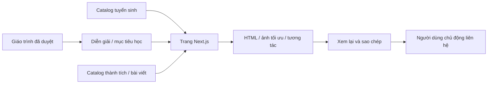
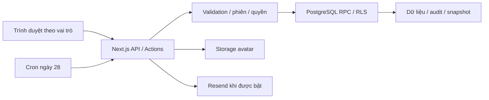

# Cấu trúc hệ thống CSAT Portal

Một ứng dụng Next.js phục vụ website công khai và admin/gia sư/phụ huynh. Không cần tách dịch vụ hoặc repository chỉ để chia frontend/backend. Trạng thái triển khai ở [PROJECT_STATUS](PROJECT_STATUS.md), quy trình ở [frontend](FRONTEND_WORKFLOW.md) và [backend](BACKEND_WORKFLOW.md).

## Phân chia trách nhiệm

| Tầng | Trách nhiệm | Ranh giới |
|---|---|---|
| Route/layout/component | Trang, dữ liệu để hiển thị, responsive, tương tác và accessibility | Không thay Auth/quyền/transaction |
| API/Server Action | Validation, phiên/Origin/phạm vi, gọi nghiệp vụ và ánh xạ lỗi | Không tin client/UUID/menu ẩn |
| Contract/read model | Request/response, enum, revision, draft/published, null và lỗi | Giữ tương thích khi mở rộng |
| RPC/RLS/PostgreSQL | Quyền, ghi atomic, audit/snapshot và dữ liệu hiệu lực | Không bỏ qua qua helper ghi trực tiếp |
| Storage/tích hợp | Avatar/outbox/email và API bên ngoài khi được bật | Service key chỉ server, tác động thật đúng quyền |

proxy.ts định tuyến/làm mới phiên, không thay quyền API/database. app/(auth) là route group không tạo tiền tố URL.

## Website công khai: dữ liệu đến giao diện

- Catalog lib/public-courses.ts sở hữu A/B/C/E/K, facts/giá/đối tượng/ảnh/hashtag; JSON curriculum quyết định mã/tên/thứ tự, lib/public-roadmap-content.ts diễn giải, lib/public-course-outcomes.ts giữ mục tiêu học.
- RoadmapCourseSection/CourseKnowledge render tổng quan; FlagshipCourseSection giữ riêng một mục E. CourseDetailContent/CourseStageNavigation/CourseOutcomes render chi tiết; native disclosure/mũi tên chỉ điều hướng, không ghi tiến độ.
- C là tên công khai của toàn bộ C/D và các lớp nâng cao tương lai; giữ 19 chủ đề C01–D07, scope CD, template và lớp quản lý hiện có. A+B chỉ gộp nội bộ; public tách A/B. E tuyển riêng từ C, không map tự động vào voi/PreVOI. K chọn nguồn chéo chương trình là thiết kế tương lai, chưa triển khai.
- /dang-ky-hoc đọc query course theo whitelist. CTA từ lớp truyền mặc định; route lớp có ưu tiên hơn query. PublicConsultation chỉ validate/xem lại/sao chép, không gọi API hoặc lưu bền vững. Backend tư vấn vẫn là luồng độc lập.
- /thanh-tich là static route, lib/public-achievements.ts và WebP responsive dựng sẵn; tách hồ sơ Portal, không API/CMS. /bai-dang lấy lib/public-posts.ts; /gia-su dùng chung TutorShowcase.
- /hoc-lieu-mien-phi tái dùng PracticeVideo/form frontend. Footer/dock lấy lib/public-contact.ts. /login là switch Phụ huynh/Gia sư dùng handler riêng, /tutor qua proxy rồi redirect nếu chưa có phiên.

Bản đồ route/component và hành vi ở [PUBLIC_WEBSITE](PUBLIC_WEBSITE.md); nội dung tuyển sinh ở [catalog](PUBLIC_COURSE_CATALOG.md). Không để tài liệu kiến trúc thành nhật ký chỉnh màu/kích thước.

## Ranh giới UI và tài nguyên

CSS public scope .csat-public; font toàn hệ thống Archivo. PublicHeader tái dùng menu tại login/ParentShell, nội dung nghiệp vụ nằm ngoài scope marketing.

CoursePosterPreview: tổng quan interactive=false trả ảnh/div tĩnh, chi tiết/đăng ký mở native dialog và fallback WebP khi no-JS. CSS trigger relative chỉ khớp ảnh không phải background; description-band giữ absolute independent thứ tự tải chunk. Ảnh lớn chỉ dựng khi mở, không API/scroll lock.

PublicSectionNavigation là hai nút fixed overlay, không dành cột; đến section/header liền kề. Reveal/listener/observer/rAF dọn khi đổi route. PracticeVideo dừng ngoài viewport/tab ẩn, fallback poster/no-JS/reduce. Style và trạng thái đọc ở [design system](PUBLIC_UI_DESIGN_SYSTEM.md)/[motion](UI_MOTION_WORKFLOW.md).

Runtime chỉ chứa media tối ưu đã chọn; raw source, prototype và công cụ local ngoài Git/gói build. Không import scratch/internal để chạy ứng dụng.

## Luồng nghiệp vụ

## Ranh giới quyền

| Vai trò | Cơ chế | Điểm mã cần đọc |
|---|---|---|
| Admin | Supabase Auth; role từ `app_metadata`, API và RPC kiểm tra quyền | `lib/business-api.ts`, `lib/auth-routing.ts`, `lib/supabase/server.ts` |
| Gia sư | Supabase Auth; `tutors.auth_uid`, hoạt động/phân công hoặc quyền lịch sử theo RPC | `app/api/tutor/`, `features/attendance/`, migrations quyền |
| Phụ huynh | Số điện thoại mở lookup, cookie HttpOnly 12 giờ, hash phiên và parent–student links | `lib/parent-lookup.ts`, `app/api/parents/auth/route.ts`, `app/parents/page.tsx` |
| Tác vụ máy chủ | Service-role client sau kiểm tra quyền/secret và điều kiện nghiệp vụ | `lib/supabase/service.ts`, email/profile API |

Phụ huynh **không dùng Supabase Phone Auth/OTP**; lookup không chứng minh người nhập sở hữu số. Service key vượt RLS nên mọi endpoint dùng nó phải kiểm tra quyền/phạm vi độc lập. Không coi cookie, menu hay UUID khó đoán là đủ quyền xem học sinh.

## Dữ liệu theo miền nghiệp vụ

| Miền | Bảng/view tiêu biểu | Bất biến |
|---|---|---|
| Con người | `students`, `tutors`, `parent_accounts`, `parent_student_links` | Không tự ghép người bằng tên; không xóa dây chuyền lịch sử |
| Lớp và lịch | `classes`, `class_students`, `class_enrollments`, `sessions`, lịch sử gia sư/đơn giá | Dùng ngày hiệu lực và roster, không suy từ trạng thái lớp hiện tại |
| Điểm danh | `session_attendance`, `attendance_current`, `session_roster_verifications`, `attendance_fee_verifications` | Snapshot/đính chính; buổi đã chốt không sửa trực tiếp |
| Kế toán | `billing_periods`, `billing_sessions`, `billing_items`, `billing_adjustments`, `payments`, `payment_events` | Chốt thủ công/atomic, thu–hoàn bằng sự kiện, giữ chứng từ gốc |
| Học tập | `learning_templates`, `learning_defaults`, `learning_records`, `learning_history`, `student_reviews` | Nháp/công bố tách riêng, revision và lịch sử |
| Hồ sơ gia sư | `tutor_public_profiles`, `tutor_avatar_assets` (22) | Lưu công bố ngay, ownership/revision, cleanup không xóa ảnh đang dùng |
| Tư vấn/email | `consultation_requests`, `consultation_email_outbox` (18), `review_email_runs`, `review_email_outbox`, `email_reconciliations` (19) | Lưu yêu cầu/outbox atomic; không reset job để gửi lại |
| Nội bộ DB | `csat_internal.schema_migrations`, snapshot và dữ liệu đối chiếu | Không mở schema nội bộ cho Data API |

Tên đầy đủ, kiểu và chữ ký hàm phải đọc SQL hiện hành; `types/database.ts` và các type trong `lib/` phục vụ ứng dụng, không chứng minh schema môi trường đã đúng.

## Các đường dữ liệu cần hiểu

**Quản lý và học phí:** form → API/Server Action → validation + phiên + Origin → RPC → transaction/audit → view/RPC báo cáo. `lib/business-client.ts` hỗ trợ client; `lib/business-api.ts` ánh xạ lỗi. Chốt sổ gọi `close_billing_period` với preview token và request ID. Xem [nghiệp vụ học phí](BILLING_LOGIC.md).

**Lộ trình:** nội dung đã duyệt trong `lib/learning-curriculum-20260922.json` và [tài liệu đào tạo](CHUONG_TRINH_DAO_TAO.md) → template/default theo chương trình → cấu hình lớp → bản công bố cho phụ huynh. Gia sư/admin chủ động chọn chặng đang học; chặng đang xem trên UI là trạng thái khác. Template/tag cũ được giữ để bảo toàn lịch sử, không phải tệp thừa.

**Phụ huynh:** lookup hợp lệ → RPC `parent_learning_portal` kiểm tra học sinh thuộc liên kết → JSON do `lib/parent-learning.ts` định nghĩa → `ParentPortalView`. Thứ tự: học sinh → nhận xét → lộ trình → định hướng → buổi học → CSATOJ → gia sư/học phí. Thẻ gia sư gộp theo tutor ID, không lộ liên hệ riêng. Logo bên trái, shell/menu riêng.

**Chuyên đề phụ huynh:** danh mục có kiểu `lib/parent-topics.ts` ghép metadata trong `lib/parent-topic-catalog/` với 54 Markdown cho 43 mã tại `content/parent-topics/`, chỉ trên khung chuẩn và giáo án hiệu lực đã công bố. `/parents/chuyen-de/[slug]` kiểm tra lookup, học sinh, lớp và topic qua RPC ở máy chủ rồi mới đọc toàn văn; SSR private/no-store/noindex, không chung catalog bài đăng công khai. Markdown không HTML/MDX, Shiki server-only tạo các token code; quy ước blockquote câu hỏi được chuyển thành native disclosure bằng `lib/parent-topic-questions.ts`. Client chỉ nhận bài được phép đọc và thao tác sao chép. Next file tracing đóng gói Markdown. [Quyết định và giới hạn](PARENT_TOPICS.md).

Migration 23 bổ sung `class_progress?` theo toàn bộ session completed đã kết thúc của lớp được phép xem. UI suy ra chặng định hướng theo giáo án hiệu lực, không phụ thuộc tháng hoặc nghỉ riêng, không ghi trạng thái thành thạo. Thiếu aggregate fallback chặng gia sư công bố, không biến thành zero. Chưa áp production.

**Ảnh gia sư:** form multipart → API kiểm tra ownership/revision → Sharp kiểm tra ảnh, xoay/cắt 512×512, WebP ≤200 KiB → Storage → RPC lưu profile → dọn ảnh cũ sau thành công. `tutor_avatar_assets` theo dõi vòng đời để xử lý kết quả ghi không chắc chắn. Bucket public để xem, client không được ghi trực tiếp.

**Backend tư vấn/email:** endpoint tư vấn lưu request và outbox cùng transaction → thử gửi nếu cờ Production bật → lưu kết quả provider. Form công khai mới chưa gọi endpoint này; cần adapter và nghiệm thu khi nối. Nhắc tháng gộp một thư/gia sư; admin xem hàng đợi, reconcile và xử lý ngoại lệ. Lịch trong `vercel.json` là `0 1 28 * *` UTC (08:00 Việt Nam). Mã có lease, retry, idempotency; MAIL-01/02 vẫn cần sửa trước bật. Không có scheduler retry riêng.

Kho nội bộ, prototype và cấu hình công cụ local được loại khỏi TypeScript/lint lẫn gói Vercel CLI. Không import các tệp đó từ mã runtime. Tài nguyên phục vụ website chỉ giữ bản được chọn; nguồn thiết kế không phải dependency của build.

## Phân loại script

| Nhóm | Đường dẫn | Tác động |
|---|---|---|
| Chất lượng repo | `scripts/check-repository.cjs`, `scripts/tests/` | Chỉ đọc tệp/index, dữ liệu test giả |
| Test database/API | `database/tests/` | PGlite/PostgreSQL tách biệt, không nạp `.env` production |
| Preview/QA | `scripts/preview-public-site.cjs`, `run-*-ui.cjs`, `database/tests/browser/` | Server localhost, fixture giả; output vào scratch; đọc header script trước chạy |
| Audit DB | `scripts/audit-release.cjs`, `audit-curriculum.cjs` | Nạp cấu hình local, kết nối DB chỉ đọc, log tổng hợp; không chạy mặc định khi onboarding |
| Vận hành | `scripts/email-smoke.cjs`, `tutor-avatar-cleanup.cjs` | Mặc định preview/dry-run; `--send`/`--apply` có tác động thật và cần phép |
| SQL maintenance | `database/maintenance/` | Thay đổi dữ liệu một lần có điều kiện; không phải migration tự động |

Bộ public browser QA dùng Playwright khóa version trong devDependency, Chromium cài riêng và bản build placeholder trên loopback. CI chạy nhóm smoke; `PLAYWRIGHT_MODULE` chỉ là override local tùy chọn. Các runner Portal riêng vẫn cần fixture/môi trường theo hướng dẫn tương ứng; không đưa runtime Codex của máy tác giả vào Git.

## Hướng tổ chức module

Cấu trúc hiện tại phù hợp với một ứng dụng Next.js phục vụ quy mô trung tâm: trang/API nằm trong `app`, giao diện có thành phần dùng chung, các thao tác tài chính và học tập quan trọng có RPC/transaction/audit. Chưa có nhu cầu tách thành nhiều dịch vụ; ưu tiên hoàn thiện ranh giới trong ứng dụng hiện có.

Điểm cần chỉnh là tính nhất quán khi phát triển thêm:

- `app/admin/classes/[id]/page.tsx` hơn 1.000 dòng, cùng giữ trạng thái form, truy vấn dữ liệu và nhiều nhóm giao diện. Nên tách danh sách học sinh, lịch/buổi học, thay đổi gia sư/đơn giá và lịch sử thành các phần có trách nhiệm rõ ràng.
- Truy vấn và thao tác hiện nằm ở cả trang, `features/*` và `lib/*`. Với phần sửa mới, để trang điều phối, module nghiệp vụ quản lý query/action/validation, component nhận dữ liệu và xử lý tương tác. Không cần di chuyển đồng loạt chỉ để đổi cây thư mục.
- Đã bỏ `features/tutors/actions.ts` cùng kiểu input chỉ dùng ở đó sau khi xác minh không có import, re-export hoặc nơi gọi. Quản lý gia sư dùng `app/api/admin/tutors/route.ts` để tạo Auth user và vô hiệu hóa mềm; hồ sơ công khai dùng API profile riêng. Không tái tạo helper ghi/xóa trực tiếp song song với các luồng này.
- Kiểu dữ liệu và validation cần nhất quán giữa UI/API/RPC; các trang lớn còn dùng `any`. Ưu tiên hợp đồng dữ liệu của luồng đang sửa, tránh thay kiểu hàng loạt khi chưa có kiểm thử.
- CI có database test và public browser smoke dùng dependency đã khóa. Tiếp tục chuẩn hóa môi trường thử cho Portal và nghiệm thu staging trước khi coi quy trình phát hành đã hoàn chỉnh.

Tiêu chí sau mỗi đợt tách module: hành vi và quyền không đổi, lịch sử được bảo toàn, kiểm thử liên quan đạt và thành viên mới tìm được nơi sửa một nghiệp vụ mà không phải dò nhiều cách triển khai song song.

Renderer chuyên đề giữ nội dung Markdown trong repo theo quyết định đã chốt. Shiki import riêng C++/github-dark, dùng chung highlighter; cache thân bài/mục lục tối đa 54 nội dung trên worker. Header, ngữ cảnh học sinh–lớp và kết quả RPC không được cache chung; route xác thực/kiểm tra bản công bố mỗi lần đọc rồi mới gọi renderer. Xem [chuyên đề phụ huynh](PARENT_TOPICS.md).
