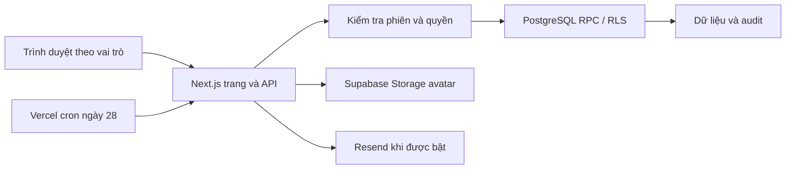

# Cấu trúc hệ thống CSAT Portal

Đối chiếu mã tại `c4cf9f8` và thay đổi local ngày 01/10/2026. Đây là bản đồ triển khai; trạng thái production xem [PROJECT_STATUS.md](PROJECT_STATUS.md).

## Luồng chính

`proxy.ts` định tuyến và làm mới phiên; nó không thay thế quyền của API/database. Public pages là `/`, `/lo-trinh`, `/lo-trinh/[program]`; admin `/admin`, gia sư `/tutor`, phụ huynh `/parents`. `app/(auth)` là route group, không tạo tiền tố URL.

## Ranh giới quyền

| Vai trò | Cơ chế | Điểm mã cần đọc |
|---|---|---|
| Admin | Supabase Auth; role từ `app_metadata`, API và RPC kiểm tra quyền | `lib/business-api.ts`, `lib/auth-routing.ts`, `lib/supabase/server.ts` |
| Gia sư | Supabase Auth; `tutors.auth_uid`, hoạt động/phân công hoặc quyền lịch sử theo RPC | `app/api/tutor/`, `features/attendance/`, migrations quyền |
| Phụ huynh | Số điện thoại mở lookup, cookie HttpOnly 12 giờ, hash phiên và parent–student links | `lib/parent-lookup.ts`, `app/api/parents/auth/route.ts`, `app/parents/page.tsx` |
| Tác vụ máy chủ | Service-role client sau kiểm tra quyền/secret và điều kiện nghiệp vụ | `lib/supabase/service.ts`, email/profile API |

Phụ huynh **không dùng Supabase Phone Auth/OTP**; lookup không chứng minh người nhập sở hữu số. Service key vượt RLS nên mọi endpoint dùng nó phải kiểm tra quyền/phạm vi độc lập. Không coi cookie, menu hay UUID khó đoán là đủ quyền xem học sinh.

## Dữ liệu theo miền nghiệp vụ

| Miền | Bảng/view tiêu biểu | Bất biến |
|---|---|---|
| Con người | `students`, `tutors`, `parent_accounts`, `parent_student_links` | Không tự ghép người bằng tên; không xóa dây chuyền lịch sử |
| Lớp và lịch | `classes`, `class_students`, `class_enrollments`, `sessions`, lịch sử gia sư/đơn giá | Dùng ngày hiệu lực và roster, không suy từ trạng thái lớp hiện tại |
| Điểm danh | `session_attendance`, `attendance_current`, `session_roster_verifications`, `attendance_fee_verifications` | Snapshot/đính chính; buổi đã chốt không sửa trực tiếp |
| Kế toán | `billing_periods`, `billing_sessions`, `billing_items`, `billing_adjustments`, `payments`, `payment_events` | Chốt thủ công/atomic, thu–hoàn bằng sự kiện, giữ chứng từ gốc |
| Học tập | `learning_templates`, `learning_defaults`, `learning_records`, `learning_history`, `student_reviews` | Nháp/công bố tách riêng, revision và lịch sử |
| Hồ sơ gia sư | `tutor_public_profiles`, `tutor_avatar_assets` (22) | Lưu công bố ngay, ownership/revision, cleanup không xóa ảnh đang dùng |
| Tư vấn/email | `consultation_requests`, `consultation_email_outbox` (18), `review_email_runs`, `review_email_outbox`, `email_reconciliations` (19) | Lưu yêu cầu/outbox atomic; không reset job để gửi lại |
| Nội bộ DB | `csat_internal.schema_migrations`, snapshot và dữ liệu đối chiếu | Không mở schema nội bộ cho Data API |

Tên đầy đủ, kiểu và chữ ký hàm phải đọc SQL hiện hành; `types/database.ts` và các type trong `lib/` phục vụ ứng dụng, không chứng minh schema môi trường đã đúng.

## Các đường dữ liệu cần hiểu

**Quản lý và học phí:** form → API/Server Action → validation + phiên + Origin → RPC → transaction/audit → view/RPC báo cáo. `lib/business-client.ts` hỗ trợ client; `lib/business-api.ts` ánh xạ lỗi. Chốt sổ gọi `close_billing_period` với preview token và request ID. Xem [nghiệp vụ học phí](BILLING_LOGIC.md).

**Lộ trình:** nội dung đã duyệt trong `lib/learning-curriculum-20260922.json` và [tài liệu đào tạo](CHUONG_TRINH_DAO_TAO.md) → template/default theo chương trình → cấu hình lớp → bản công bố cho phụ huynh. Gia sư/admin chủ động chọn chặng đang học; chặng đang xem trên UI là trạng thái khác. Template/tag cũ được giữ để bảo toàn lịch sử, không phải tệp thừa.

**Phụ huynh:** lookup hợp lệ → RPC `parent_learning_portal` kiểm tra học sinh thuộc liên kết → JSON do `lib/parent-learning.ts` định nghĩa → `ParentPortalView`. Thứ tự: học sinh → nhận xét → lộ trình → định hướng → buổi học → CSATOJ → gia sư/học phí. Thẻ gia sư gộp theo tutor ID, không lộ liên hệ riêng. Logo bên trái, shell/menu riêng.

**Ảnh gia sư:** form multipart → API kiểm tra ownership/revision → Sharp kiểm tra ảnh, xoay/cắt 512×512, WebP ≤200 KiB → Storage → RPC lưu profile → dọn ảnh cũ sau thành công. `tutor_avatar_assets` theo dõi vòng đời để xử lý kết quả ghi không chắc chắn. Bucket public để xem, client không được ghi trực tiếp.

**Tư vấn/email:** form lưu request và outbox cùng transaction → thử gửi nếu cờ Production bật → lưu kết quả provider. Nhắc tháng gộp một thư/gia sư; admin xem hàng đợi, reconcile và xử lý ngoại lệ. Lịch trong `vercel.json` là `0 1 28 * *` UTC (08:00 Việt Nam). Mã có lease, retry, idempotency; MAIL-01/02 vẫn cần sửa trước bật. Không có scheduler retry riêng.

## Phân loại script

| Nhóm | Đường dẫn | Tác động |
|---|---|---|
| Chất lượng repo | `scripts/check-repository.cjs`, `scripts/tests/` | Chỉ đọc tệp/index, dữ liệu test giả |
| Test database/API | `database/tests/` | PGlite/PostgreSQL tách biệt, không nạp `.env` production |
| Preview/QA | `scripts/preview-public-site.cjs`, `run-*-ui.cjs`, `database/tests/browser/` | Server localhost, fixture giả; output vào scratch; đọc header script trước chạy |
| Audit DB | `scripts/audit-release.cjs`, `audit-curriculum.cjs` | Nạp cấu hình local, kết nối DB chỉ đọc, log tổng hợp; không chạy mặc định khi onboarding |
| Vận hành | `scripts/email-smoke.cjs`, `tutor-avatar-cleanup.cjs` | Mặc định preview/dry-run; `--send`/`--apply` có tác động thật và cần phép |
| SQL maintenance | `database/maintenance/` | Thay đổi dữ liệu một lần có điều kiện; không phải migration tự động |

Bộ browser QA cần Playwright/Chromium riêng; runtime Codex trên máy tác giả không được đưa vào Git. Truyền `PLAYWRIGHT_MODULE` theo máy nếu dùng runner tương ứng; đây chưa phải CI browser có tính di động đầy đủ.

## Đánh giá cấu trúc và hướng chỉnh dần — 01/10/2026

Cấu trúc hiện tại phù hợp với một ứng dụng Next.js phục vụ quy mô trung tâm: trang/API nằm trong `app`, giao diện có thành phần dùng chung, các thao tác tài chính và học tập quan trọng có RPC/transaction/audit. Chưa có nhu cầu tách thành nhiều dịch vụ; ưu tiên hoàn thiện ranh giới trong ứng dụng hiện có.

Điểm cần chỉnh là tính nhất quán khi phát triển thêm:

- `app/admin/classes/[id]/page.tsx` hơn 1.000 dòng, cùng giữ trạng thái form, truy vấn dữ liệu và nhiều nhóm giao diện. Nên tách danh sách học sinh, lịch/buổi học, thay đổi gia sư/đơn giá và lịch sử thành các phần có trách nhiệm rõ ràng.
- Truy vấn và thao tác hiện nằm ở cả trang, `features/*` và `lib/*`. Với phần sửa mới, để trang điều phối, module nghiệp vụ quản lý query/action/validation, component nhận dữ liệu và xử lý tương tác. Không cần di chuyển đồng loạt chỉ để đổi cây thư mục.
- `features/tutors/actions.ts` còn các helper tạo/xóa trực tiếp khác với API admin đang tạo Auth user và vô hiệu hóa mềm. Tìm kiếm tĩnh không thấy nơi import/gọi các helper này. Cần xác minh trước khi bỏ hoặc hợp nhất; chưa kết luận đây là luồng lỗi đang được người dùng gọi.
- Kiểu dữ liệu và validation cần nhất quán giữa UI/API/RPC; các trang lớn còn dùng `any`. Ưu tiên hợp đồng dữ liệu của luồng đang sửa, tránh thay kiểu hàng loạt khi chưa có kiểm thử.
- CI và database test đã có cấu hình; browser QA còn phụ thuộc runtime máy tác giả. Hoàn thiện môi trường thử và runner dùng chung trước khi coi quy trình phát hành đã hoàn chỉnh.

Tiêu chí sau mỗi đợt tách module: hành vi và quyền không đổi, lịch sử được bảo toàn, kiểm thử liên quan đạt và thành viên mới tìm được nơi sửa một nghiệp vụ mà không phải dò nhiều cách triển khai song song.
