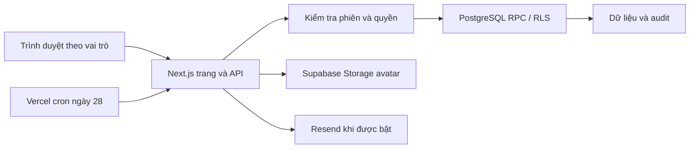

# Cấu trúc hệ thống CSAT Portal

**Trang công khai 05/10:** `/gia-su` tái sử dụng `TutorShowcase` với trang chủ; `/bai-dang` và `/bai-dang/[slug]` lấy văn bản thuần từ `lib/public-posts.ts`, chưa có database đăng bài. `PracticeVideo` tải bản media tối ưu theo viewport và dọn observer/listener khi unmount. Chi tiết ở [PUBLIC_POSTS](PUBLIC_POSTS.md) và [PUBLIC_WEBSITE](PUBLIC_WEBSITE.md); không đổi auth/RPC.

**UI 05/10/2026:** PublicHeader tái sử dụng PublicNavigation cho login, tutor entry và ParentShell; không đổi auth/RPC. PublicSelect dùng Base UI cho form frontend và bộ chọn hướng học; dữ liệu tư vấn vẫn chưa gửi. Font toàn ứng dụng thống nhất Archivo. Quy tắc tại [PUBLIC_WEBSITE](PUBLIC_WEBSITE.md).

**Giao diện công khai cập nhật 05/10/2026:** tích hợp catalog A/B/C/E/K vào React/Next.js, các thành phần và ranh giới xem [PUBLIC_WEBSITE](PUBLIC_WEBSITE.md). Chưa thay enum/validation/RPC hoặc dữ liệu lớp. A/B dùng khung Cơ bản; C dùng C+D; E Chủ lực tuyển riêng từ C, tách PreVOI trong quản lý; K tùy chọn cần bản sao có nguồn/version và quyền trước khi vận hành. Không dùng mã tuyển sinh để tự đổi chương trình hay hình thức học. Các hợp đồng tương lai nằm trong [catalog](PUBLIC_COURSE_CATALOG.md).

Ranh giới dưới đây được đối chiếu lại ngày **06/10/2026** với mã nền `f83c3a6`; không kiểm tra production trong đợt tài liệu. Trạng thái và bằng chứng môi trường xem [PROJECT_STATUS.md](PROJECT_STATUS.md).

## Phân chia frontend và backend

Hai phần ở cùng ứng dụng, không cần tách thành dịch vụ/repository riêng để làm tiếp.

| Phần | Sở hữu | Không thay thế |
|---|---|---|
| Frontend | Route/layout/component, nội dung, token, form state, responsive, accessibility và vòng đời hiệu ứng | Xác thực, quyền đọc/ghi, transaction và lịch sử |
| Backend | API/Server Actions, validation/phiên/Origin, phạm vi truy cập, RPC/RLS, snapshot/audit, Storage/outbox | UI phải trình bày đúng trạng thái/thiếu dữ liệu và phản hồi lỗi |
| Hợp đồng chung | Request/response, enum, revision, published/draft, `null`, lỗi và adapter tương thích | Không tự map catalog tuyển sinh thành enum chương trình database |

Workflow thực hiện: [frontend](FRONTEND_WORKFLOW.md), [backend](BACKEND_WORKFLOW.md). Tiếp nhận công việc: [HANDOFF](HANDOFF.md). Nguồn chuẩn chỉ duy trì ở tài liệu chuyên môn tương ứng, tránh chép toàn bộ backlog vào từng workflow.

## Luồng chính

**Catalog tách A/B, cập nhật 06/10:** Website chỉ giới thiệu, tư vấn và đăng ký các lớp A/B/C/E/K riêng. A+B là cách gộp tạm của quản lý nội bộ, không có entry point công khai; `/lo-trinh/co-ban` và `/lo-trinh/basic` chuyển về tổng quan và không nằm trong sitemap. Chương trình `basic`, mặc định A+B và bản công bố/lịch sử hiện có giữ nguyên; định hướng lớp tương lai tách riêng cần đặc tả backend và chuyển đổi được phép.

**Lộ trình công khai, biên tập 06/10:** `lib/public-courses.ts` giữ dữ kiện tuyển sinh/poster; `learning-curriculum-20260922.json` quyết định mã, tên, thứ tự và phạm vi các chặng/chủ đề; `lib/public-roadmap-content.ts` diễn giải định hướng, vai trò kiến thức và kỹ năng rèn luyện. `RoadmapCourseSection` và `CourseKnowledge` trình bày tổng quan; `CourseDetailContent` trình bày tiến trình và chi tiết chủ đề. `CourseStageNavigation` mở native disclosure khi đi tới chặng, không lưu trạng thái hoặc kết luận thành thạo. E tách đường tuyển đầu vào từ C khỏi ba trọng tâm phát triển, không tạo giáo trình riêng. Căn cứ biên tập ở [nghiên cứu nội dung](ROADMAP_CONTENT_RESEARCH.md).

**Ảnh và chuyển mục, cập nhật 06/10:** `CoursePosterPreview` dùng chung cho tổng quan, chi tiết và đăng ký; liên kết tới WebP là fallback không JS, khi có JS mở native dialog toàn màn hình, có nút đóng/Escape và trả focus. Ảnh lớn chỉ được render khi mở; không gọi API hoặc đổi style khóa cuộn trang. `PublicSectionNavigation` chỉ hiện trên lộ trình/đăng ký, chuyển giữa section/header liền kề, tôn trọng reduced motion; dọn scroll/resize listener, ResizeObserver và rAF khi đổi route. CSS dành một rail riêng bên phải nội dung.

**Đăng ký học, cập nhật 06/10:** `/dang-ky-hoc` là server page đọc enum `course` A/B/C/E/K; `EnrollmentExperience` dùng catalog `lib/public-courses.ts` và truyền `defaultCourse` xuống form chung. Khóa route chi tiết có ưu tiên hơn query; mã lạ không đi vào form. Điều hướng từ thẻ/lớp tới đăng ký không gọi API hay lưu request. Nội dung chặng/tag lộ trình dùng `CourseKnowledge` và JSON curriculum hiện hành; không thay template, chương trình database hoặc quy tắc chuyển chặng.

**Form website công khai, cập nhật 04/10:** nhập → validation phía trình duyệt → xem lại/chỉnh sửa → sao chép theo thao tác người dùng. Chưa gọi API tư vấn hoặc endpoint trạng thái; dữ liệu chỉ giữ trong trang. API/RPC tư vấn hiện có vẫn là backend độc lập cho lần kết nối sau, không tự kích hoạt theo form frontend mới.

`proxy.ts` định tuyến và làm mới phiên; nó không thay thế quyền của API/database. Public pages là `/`, `/dang-ky-hoc`, `/lo-trinh`, `/lo-trinh/[program]`, `/gia-su`, `/bai-dang`, `/bai-dang/[slug]`, `/thanh-tich`, `/hoc-lieu-mien-phi`; admin `/admin`, gia sư `/tutor`, phụ huynh `/parents`. `/gia-su` giới thiệu đội ngũ, khác với kênh đăng nhập `/tutor`. `app/(auth)` là route group, không tạo tiền tố URL. `/login` là trang liên lạc chung, switch radio Phụ huynh/Gia sư; `/tutor` vẫn qua proxy kiểm tra phiên rồi chuyển người chưa đăng nhập tới `/login?role=tutor`. Hai form dùng lại handler xác thực và endpoint hiện hành, không gộp phiên/quyền. `/thanh-tich` là khung tĩnh, chưa có schema hoặc dữ liệu thành tích. `/hoc-lieu-mien-phi` dùng lại PracticeVideo và form tài liệu frontend đã tách khỏi trang chủ; không thêm API/database. Footer/dock lấy liên hệ công khai từ `lib/public-contact.ts`.

## Ranh giới quyền

| Vai trò | Cơ chế | Điểm mã cần đọc |
|---|---|---|
| Admin | Supabase Auth; role từ `app_metadata`, API và RPC kiểm tra quyền | `lib/business-api.ts`, `lib/auth-routing.ts`, `lib/supabase/server.ts` |
| Gia sư | Supabase Auth; `tutors.auth_uid`, hoạt động/phân công hoặc quyền lịch sử theo RPC | `app/api/tutor/`, `features/attendance/`, migrations quyền |
| Phụ huynh | Số điện thoại mở lookup, cookie HttpOnly 12 giờ, hash phiên và parent–student links | `lib/parent-lookup.ts`, `app/api/parents/auth/route.ts`, `app/parents/page.tsx` |
| Tác vụ máy chủ | Service-role client sau kiểm tra quyền/secret và điều kiện nghiệp vụ | `lib/supabase/service.ts`, email/profile API |

Phụ huynh **không dùng Supabase Phone Auth/OTP**; lookup không chứng minh người nhập sở hữu số. Service key vượt RLS nên mọi endpoint dùng nó phải kiểm tra quyền/phạm vi độc lập. Không coi cookie, menu hay UUID khó đoán là đủ quyền xem học sinh.

## Dữ liệu theo miền nghiệp vụ

| Miền | Bảng/view tiêu biểu | Bất biến |
|---|---|---|
| Con người | `students`, `tutors`, `parent_accounts`, `parent_student_links` | Không tự ghép người bằng tên; không xóa dây chuyền lịch sử |
| Lớp và lịch | `classes`, `class_students`, `class_enrollments`, `sessions`, lịch sử gia sư/đơn giá | Dùng ngày hiệu lực và roster, không suy từ trạng thái lớp hiện tại |
| Điểm danh | `session_attendance`, `attendance_current`, `session_roster_verifications`, `attendance_fee_verifications` | Snapshot/đính chính; buổi đã chốt không sửa trực tiếp |
| Kế toán | `billing_periods`, `billing_sessions`, `billing_items`, `billing_adjustments`, `payments`, `payment_events` | Chốt thủ công/atomic, thu–hoàn bằng sự kiện, giữ chứng từ gốc |
| Học tập | `learning_templates`, `learning_defaults`, `learning_records`, `learning_history`, `student_reviews` | Nháp/công bố tách riêng, revision và lịch sử |
| Hồ sơ gia sư | `tutor_public_profiles`, `tutor_avatar_assets` (22) | Lưu công bố ngay, ownership/revision, cleanup không xóa ảnh đang dùng |
| Tư vấn/email | `consultation_requests`, `consultation_email_outbox` (18), `review_email_runs`, `review_email_outbox`, `email_reconciliations` (19) | Lưu yêu cầu/outbox atomic; không reset job để gửi lại |
| Nội bộ DB | `csat_internal.schema_migrations`, snapshot và dữ liệu đối chiếu | Không mở schema nội bộ cho Data API |

Tên đầy đủ, kiểu và chữ ký hàm phải đọc SQL hiện hành; `types/database.ts` và các type trong `lib/` phục vụ ứng dụng, không chứng minh schema môi trường đã đúng.

## Các đường dữ liệu cần hiểu

**Quản lý và học phí:** form → API/Server Action → validation + phiên + Origin → RPC → transaction/audit → view/RPC báo cáo. `lib/business-client.ts` hỗ trợ client; `lib/business-api.ts` ánh xạ lỗi. Chốt sổ gọi `close_billing_period` với preview token và request ID. Xem [nghiệp vụ học phí](BILLING_LOGIC.md).

**Lộ trình:** nội dung đã duyệt trong `lib/learning-curriculum-20260922.json` và [tài liệu đào tạo](CHUONG_TRINH_DAO_TAO.md) → template/default theo chương trình → cấu hình lớp → bản công bố cho phụ huynh. Gia sư/admin chủ động chọn chặng đang học; chặng đang xem trên UI là trạng thái khác. Template/tag cũ được giữ để bảo toàn lịch sử, không phải tệp thừa.

**Phụ huynh:** lookup hợp lệ → RPC `parent_learning_portal` kiểm tra học sinh thuộc liên kết → JSON do `lib/parent-learning.ts` định nghĩa → `ParentPortalView`. Thứ tự: học sinh → nhận xét → lộ trình → định hướng → buổi học → CSATOJ → gia sư/học phí. Thẻ gia sư gộp theo tutor ID, không lộ liên hệ riêng. Logo bên trái, shell/menu riêng.

**Ảnh gia sư:** form multipart → API kiểm tra ownership/revision → Sharp kiểm tra ảnh, xoay/cắt 512×512, WebP ≤200 KiB → Storage → RPC lưu profile → dọn ảnh cũ sau thành công. `tutor_avatar_assets` theo dõi vòng đời để xử lý kết quả ghi không chắc chắn. Bucket public để xem, client không được ghi trực tiếp.

**Backend tư vấn/email:** endpoint tư vấn lưu request và outbox cùng transaction → thử gửi nếu cờ Production bật → lưu kết quả provider. Form công khai mới chưa gọi endpoint này; cần adapter và nghiệm thu khi nối. Nhắc tháng gộp một thư/gia sư; admin xem hàng đợi, reconcile và xử lý ngoại lệ. Lịch trong `vercel.json` là `0 1 28 * *` UTC (08:00 Việt Nam). Mã có lease, retry, idempotency; MAIL-01/02 vẫn cần sửa trước bật. Không có scheduler retry riêng.

Kho nội bộ, prototype và cấu hình công cụ local được loại khỏi TypeScript/lint lẫn gói Vercel CLI. Không import các tệp đó từ mã runtime. Tài nguyên phục vụ website chỉ giữ bản được chọn; nguồn thiết kế không phải dependency của build.

## Phân loại script

| Nhóm | Đường dẫn | Tác động |
|---|---|---|
| Chất lượng repo | `scripts/check-repository.cjs`, `scripts/tests/` | Chỉ đọc tệp/index, dữ liệu test giả |
| Test database/API | `database/tests/` | PGlite/PostgreSQL tách biệt, không nạp `.env` production |
| Preview/QA | `scripts/preview-public-site.cjs`, `run-*-ui.cjs`, `database/tests/browser/` | Server localhost, fixture giả; output vào scratch; đọc header script trước chạy |
| Audit DB | `scripts/audit-release.cjs`, `audit-curriculum.cjs` | Nạp cấu hình local, kết nối DB chỉ đọc, log tổng hợp; không chạy mặc định khi onboarding |
| Vận hành | `scripts/email-smoke.cjs`, `tutor-avatar-cleanup.cjs` | Mặc định preview/dry-run; `--send`/`--apply` có tác động thật và cần phép |
| SQL maintenance | `database/maintenance/` | Thay đổi dữ liệu một lần có điều kiện; không phải migration tự động |

Bộ browser QA cần Playwright/Chromium riêng; runtime Codex trên máy tác giả không được đưa vào Git. Truyền `PLAYWRIGHT_MODULE` theo máy nếu dùng runner tương ứng; đây chưa phải CI browser có tính di động đầy đủ.

## Đánh giá cấu trúc và hướng chỉnh dần — 01/10/2026

Cấu trúc hiện tại phù hợp với một ứng dụng Next.js phục vụ quy mô trung tâm: trang/API nằm trong `app`, giao diện có thành phần dùng chung, các thao tác tài chính và học tập quan trọng có RPC/transaction/audit. Chưa có nhu cầu tách thành nhiều dịch vụ; ưu tiên hoàn thiện ranh giới trong ứng dụng hiện có.

Điểm cần chỉnh là tính nhất quán khi phát triển thêm:

- `app/admin/classes/[id]/page.tsx` hơn 1.000 dòng, cùng giữ trạng thái form, truy vấn dữ liệu và nhiều nhóm giao diện. Nên tách danh sách học sinh, lịch/buổi học, thay đổi gia sư/đơn giá và lịch sử thành các phần có trách nhiệm rõ ràng.
- Truy vấn và thao tác hiện nằm ở cả trang, `features/*` và `lib/*`. Với phần sửa mới, để trang điều phối, module nghiệp vụ quản lý query/action/validation, component nhận dữ liệu và xử lý tương tác. Không cần di chuyển đồng loạt chỉ để đổi cây thư mục.
- Ngày 05/10 đã bỏ `features/tutors/actions.ts` cùng kiểu input chỉ dùng ở đó sau khi xác minh không có import, re-export hoặc nơi gọi. Quản lý gia sư dùng `app/api/admin/tutors/route.ts` để tạo Auth user và vô hiệu hóa mềm; hồ sơ công khai dùng API profile riêng. Không tái tạo helper ghi/xóa trực tiếp song song với các luồng này.
- Kiểu dữ liệu và validation cần nhất quán giữa UI/API/RPC; các trang lớn còn dùng `any`. Ưu tiên hợp đồng dữ liệu của luồng đang sửa, tránh thay kiểu hàng loạt khi chưa có kiểm thử.
- CI và database test đã có cấu hình; browser QA còn phụ thuộc runtime máy tác giả. Hoàn thiện môi trường thử và runner dùng chung trước khi coi quy trình phát hành đã hoàn chỉnh.

Tiêu chí sau mỗi đợt tách module: hành vi và quyền không đổi, lịch sử được bảo toàn, kiểm thử liên quan đạt và thành viên mới tìm được nơi sửa một nghiệp vụ mà không phải dò nhiều cách triển khai song song.
